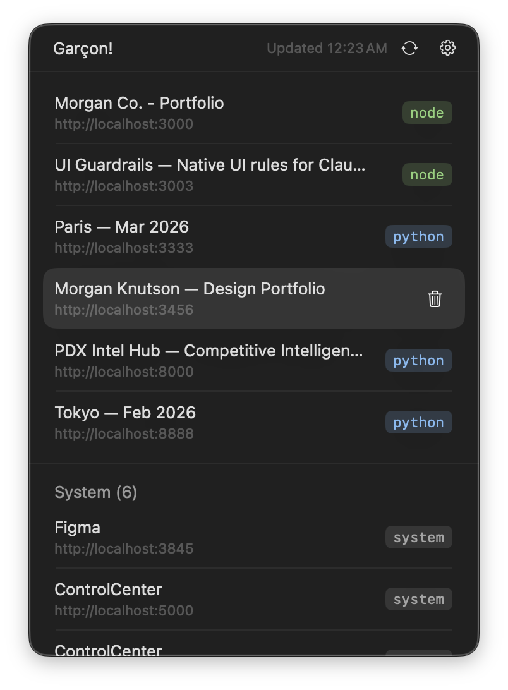

  <picture>
    <source media="(prefers-color-scheme: dark)" srcset="assets/garcon-darkmode.png">
    <source media="(prefers-color-scheme: light)" srcset="assets/garcon-lightmode.png">
    
  </picture>

 

A lightweight macOS menu bar app that shows local web servers, their ports, and quick actions to open or stop them. Garçon!

 

 

 

## What It Does

- Finds local TCP listeners and probes only HTTP/HTTPS servers.
- Prioritizes developer servers and groups system daemons under a `System` section.
- Shows page title (when available), server type badge, and URL.
- Opens server URLs when you click a row.
- Lets you stop a server with a hover-revealed trash action.
- Caches the last server list so the panel appears immediately.

## Requirements

- macOS `13+` (Ventura or newer).
- Apple Silicon (`arm64`) and Intel (`x86_64`) are both supported in release builds.

